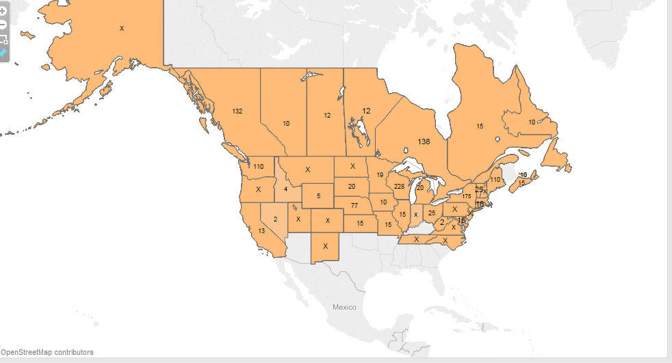
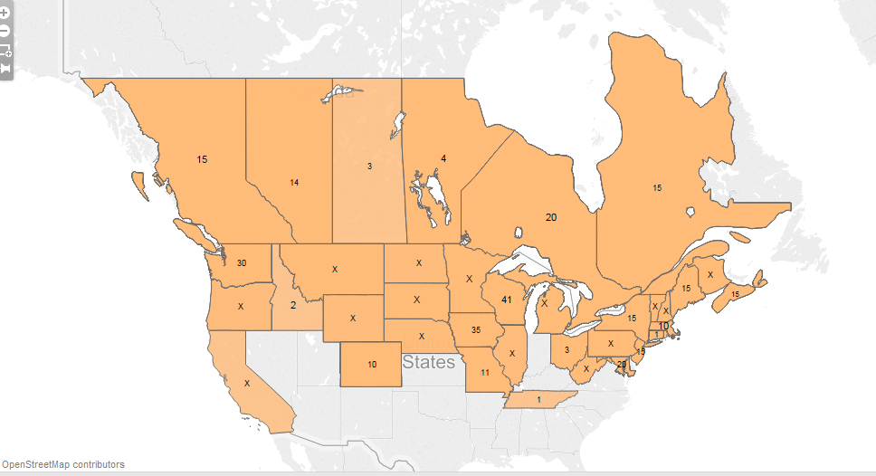
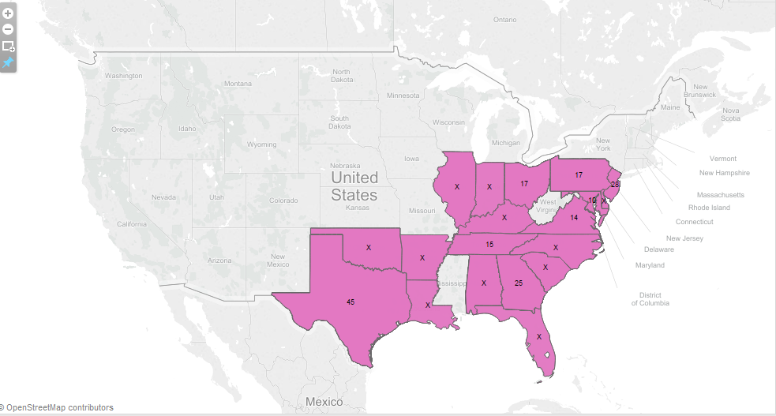
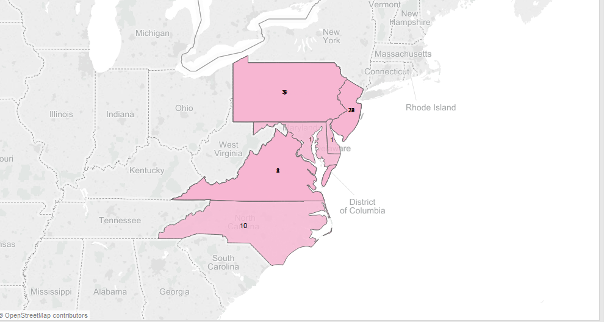

**Notes on re-creating data visualizations of the hybrid zone of the black-capped chickadee and the carolina chickadee.**
-------------------------------------------------------------------------------------------------------------------------

Looking at the hybrid zone of the chickadees and the individual zones of the chickadees
Look at the difference of the years of where people have spotted the chickadees, split into pre 1990 to post- 1990
The only problem with this visualization is I am afraid it doesn’t accurately depict the moving border of the birds’ migration patterns because it is solely dependent on those who observed it -----> problem with citizen science data mining: eBird harnesses the fact that bird watching is a hobby and proceeds to use digitally logged observations to look make some sort of conclusion about a specific bird population at whole, but this can’t be very accurate
One person who sighted a chickadee in a region more southern than it typically is will cause the data in tableau to appear slightly skewed I think

-------------------------------------------------------------------------------------------------------------------------

Need to figure out to convey ‘observation clusters’ to depict a more accurate representation of the data 
Perhaps when we import the data into excel something becomes corrupted and fills certain slots in with an X – because it is ridiculous that they would have data and a location and time/place etc. and not include how many (if any) observed it there – will need to look into this. 
-------------------------------------------------------------------------------------------------------------------------

Here is an image of the black-capped chickadee zone between 1990 and 2004 in the northern US based off of individual observations logged through eBird:
-------------------------------------------------------------------------------------------------------------------------

Here is the same black-capped species from 1950-1990:

Here is the Carolina chickadee zone as observed between the years 1950 and 1990:

Here is our pre-liminary data visualization for the hybrid zone between these two chickadee types; it is based off of all fo the observations -- the data we have contains observations from 1950 to 2004.

