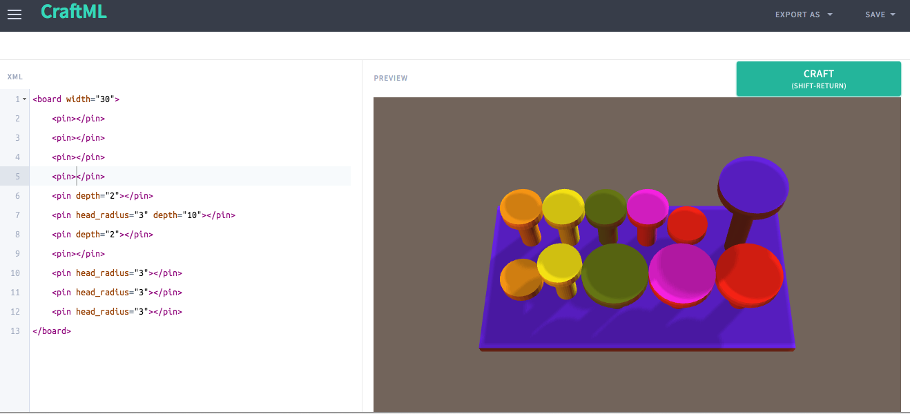
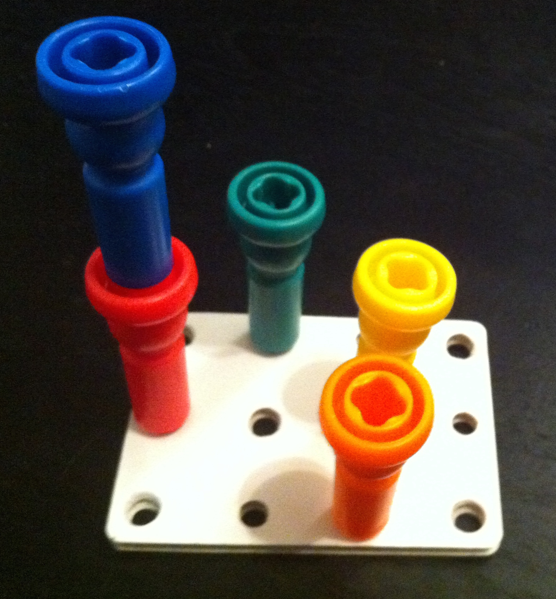

##  Reflections on Pegs and Picture Books

Sikuli lab just launched [CraftML](http://craftml.org), a website for easier 3D modeling of tactile picture book pages.  This is a subset of our [Tactile Picture Book](http://http://www.tactilepicturebooks.org/) project where we transform kids picture books into 3D prints that can be used by visually impaired children.  We hope that CraftML will enable teachers of visually impaired, parents, and visually impaired children themselves to easily create new pages without having to learn a complex modeling program.  

As a test of our initial release, I ran a lesson at a local high school in a class  on social justice.  We discussed the privilege of having objects that were designed with sight in mind and the goal of CraftML to empower people to create their own 3D books. Each high schooler was given a set of pegs and 3D cut foam board (see below) to physically model a 3D page and challenged each other to recreate that on the computer.  Afterwards, student explored additional models to create story or concept (e.g. height, size, which one doesn't match) pages for visually impaired children.  These students loved the initial design (I even heard some girls say that they never thought coding could be so fun) and found several bugs that we're currently fixing.

In addition to the potential of CraftML for those visual impairment, this test showed that CraftML may have general educational value in introducing students to a syntax similar to HTML and spatial modeling in an engaging way.

Specific lesson plans and tutorials for CraftML coming soon!

